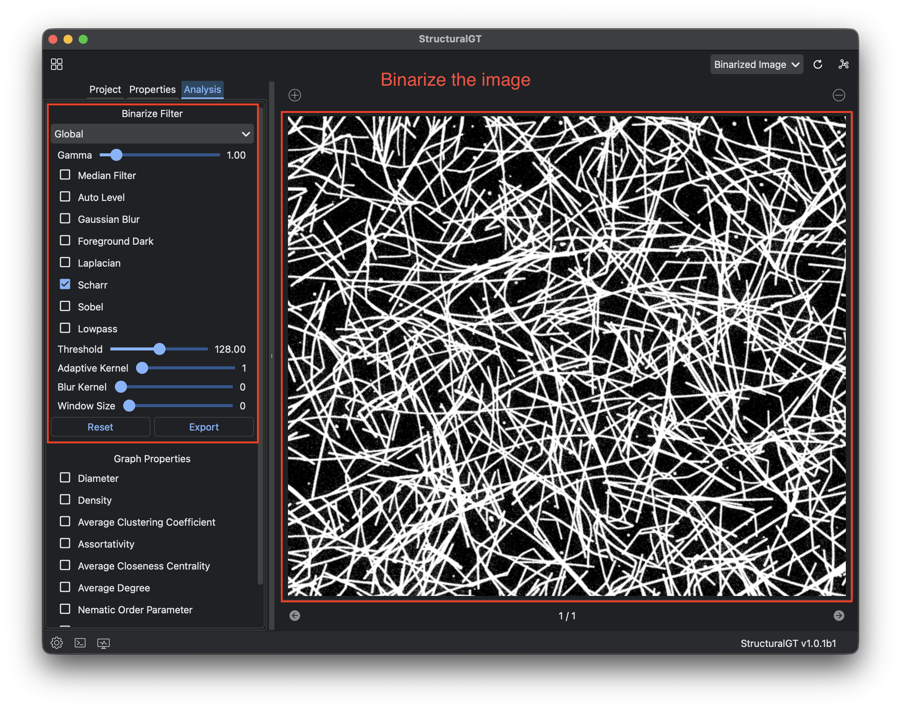
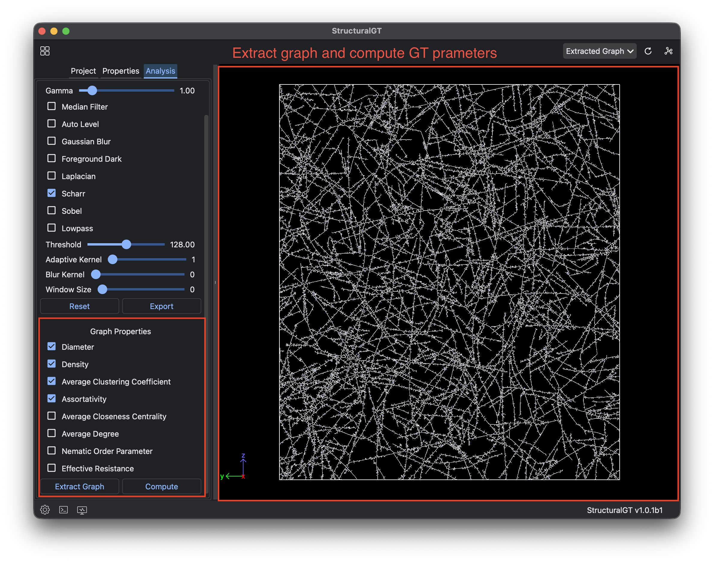
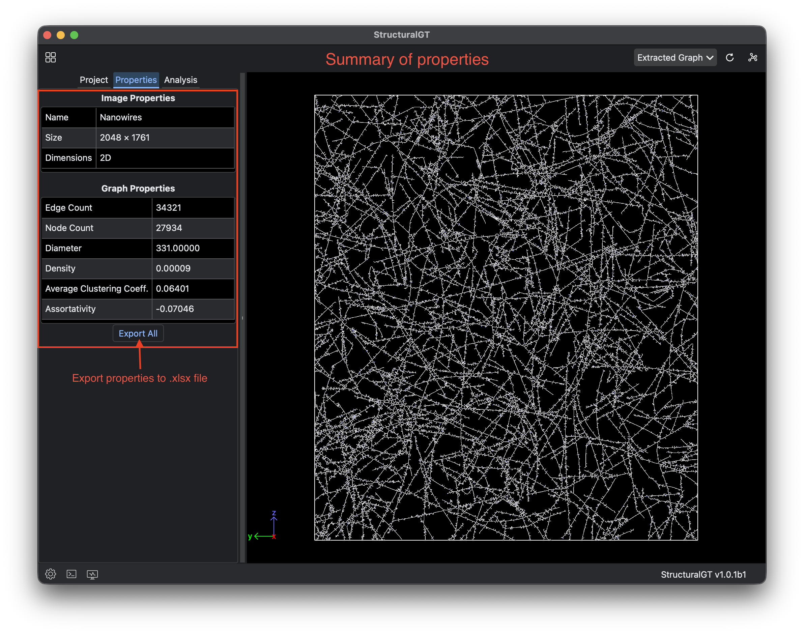

## GUI for StructuralGT

### Description

GUI application for StructuralGT analysis tool.

### Installation

Install dependencies using micromamba (or conda):

```bash
micromamba env create -f environment.yml
micromamba activate StructuralGT_GUI
```

### Usage

Start the application:

```bash
python src/main.py
```

### Building

Build the application bundle:

```bash
pyinstaller StructuralGT.spec
```

Create a DMG file (macOS):

```bash
bash build_dmg.sh
```

### Screenshots

#### Main window with project management


#### Analysis and visualization interface






